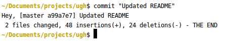
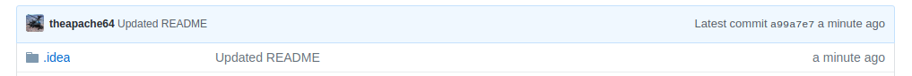
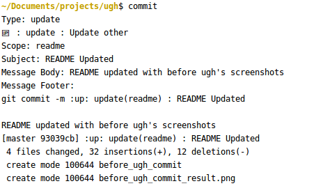
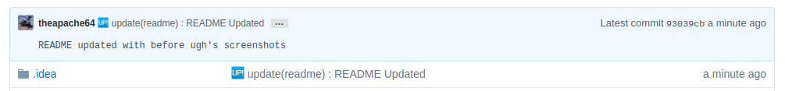

# ugh
Commit messages beautified 💖 . Inspired from [kazupon/git-commit-message-convention](https://github.com/kazupon/git-commit-message-convention)

### Usage

Before ugh, my `commit` shortcut looked like this

```
function commit(){
    git add -A
    commitMsg=$(git commit -m "$1")
    echo "Hey, $commitMsg - THE END"
}
```

After ugh, my `commit` shortcut looks like this

```
function commit(){
	git add -A &&
	java -jar /path/to/ugh.jar
}
```

### Example

##### Before

`commit`




`result`




##### After

`commit`




`result`




### Commit Types

| Emoji                      | Raw Emoji Code               | Type               | Description |
|:--------------------------:|------------------------------|--------------------|-------------|
| :star:                     | `:star:`                     | `feature`          | add **new feature** |
| :bug:                      | `:bug:`                      | `bug`              | fix **bug** issue |
| :ambulance:                | `:ambulance:`                | `critical-bug`              | ciritial hotfix **bug** issue |
| :lock:                     | `:lock:`                     | `security`         | fix **security** issue |
| :chart_with_upwards_trend: | `:chart_with_upwards_trend:` | `performance`      | fix **performance** issue |
| :zap:                      | `:zap:`                      | `improvement`      | update **backwards-compatible** feature |
| :boom:                     | `:boom:`                      | `breaking`         | update **backwards-incompatible** feature |
| :warning:                  | `:warning:`                  | `deprecated`       | **deprecate** feature |
| :globe_with_meridians:     | `:globe_with_meridians:`     | `i18n`             | update or fix **internationalization** |
| :wheelchair:               | `:wheelchair:`               | `a11y`             | update or fix **accessibility** |
| :lipstick:                 | `:lipstick:`                 | `ui-update`           | update **UI/Cosmetic** |
| :up:                       | `:up:`                       | `update`           | update **other** |
| :rotating_light:           | `:rotating_light:`           | `non-code-refactor`         | remove **linter**/strict/deprecation warnings |
| :shirt:                    | `:shirt:`                    | `code-refactor`         | **refactoring** or code **layouting** |
| :white_check_mark:         | `:white_check_mark:`         | `test-add`             | add **tests** |
| :green_heart:              | `:green_heart:`              | `test-fix`             | fix **tests** failure or **CI** building |
| :pencil:                   | `:pencil:`                   | `docs-update`             | update **documentation** |
| :copyright:                | `:copyright:`                | `licence`             | decide or change **license** |
| :lollipop:                 | `:lollipop:`                 | `example`          | for **example** or **demo** codes |
| :arrow_up:                 | `:arrow_up:`                 | `dependency-up`       | upgrade **dependencies** |
| :arrow_down:               | `:arrow_down:`               | `dependency-down`       | downgrade **dependencies** |
| :pushpin:                  | `:pushpin:`                  | `dependency-pin`       | pin **dependencies** |
| :wrench:                   | `:wrench:`                   | `config`           | update **configuration** |
| :package:                  | `:package:`                  | `build`            | **packaging** or **bundling** or **building** |
| :hatching_chick:           | `:hatching_chick:`           | `release-init`          | **initial** commit |
| :confetti_ball:            | `:confetti_ball:`            | `release-major`          | release **major** version |
| :tada:                     | `:tada:`                     | `release-minor`          | release **minor** version |
| :sparkles:                 | `:sparkles:`                 | `release-patch`          | release **patch** version |
| :rocket:                   | `:rocket:`                   | `release-deploy`          | **deploy** to production enviroment |
| :bookmark:                 | `:bookmark:`                 | `release-tagged`          | **tagged** with version label |
| :back:                     | `:back:`                     | `revert`           | **revert** commiting |
| :construction:             | `:construction:`             | `wip`              | **WIP** commiting |
| :truck:                    | `:truck:`                    | `move`             | **move** or **rename** files, repository, ... |
| :twisted_rightwards_arrows:| `:twisted_rightwards_arrows:`| `merge`                  | merge **conflict resolution** |
| :heavy_plus_sign:          | `:heavy_plus_sign:`          | `add`                  | **add** files, dependencies, ... |
| :heavy_minus_sign:         | `:heavy_minus_sign:`         | `remove`               | **remove** files, dependencies, ... |
| :on:                       | `:on:`                       | `enable`                  | **enable** feature and something ... |


### Author
theapache64 - theapache64@gmail.com
